  <picture>
    <source media="(prefers-color-scheme: dark)" srcset="dark.svg">
    <source media="(prefers-color-scheme: light)" srcset="light.svg">
    
  </picture>

> **AI & ML Systems Engineer** specializing in Deep Learning, Model Context Protocol (MCP) orchestrations, and high-throughput Hybrid RAG systems.  
> **Location:** India &nbsp;•&nbsp; **Education:** B.Tech Computer Science (AI & ML Undergrad)

---

## ⚡ Quick Proof of Work & Quantified Impact

| Metric | Project / Domain | Stack & Architecture | Repository |
| :--- | :--- | :--- | :--- |
| **100K Profiles in ~3.5s** | Offline Candidate Discovery & Ranking Pipeline | BM25 Retrieval + LightGBM LambdaRank + Gemma3 Pairwise Judgments | [View Repo](https://github.com/Pranjal1342/Intelligent-Candidate-Discovery-Ranking-System) |
| **96.49% Acc / 0.996 AUC** | Clinical Breast Cancer ML Classifier | End-to-end clinical feature extraction & high-precision classification | [*Verified Metric*](https://github.com/Pranjal1342) |
| **IEEE CIS x MSRIT '26** | MSME Payment Compliance Orchestration | Multi-Agent Model Context Protocol (MCP) Hackathon System | [*Active Build*](https://github.com/Pranjal1342) |

---

## 🚀 Featured Engineering & Open Source Projects

### 1. [Intelligent Candidate Discovery & Ranking System](https://github.com/Pranjal1342/Intelligent-Candidate-Discovery-Ranking-System)
> **Offline multi-stage pipeline ranking 100,000 candidate profiles in ~3.5 seconds.**
- **Architecture**: Two-stage retrieval-ranking system combining **BM25 sparse candidate retrieval** with a **LightGBM LambdaRank** reranker.
- **Data & Training**: Trained using **Gemma3** pairwise preference judgments with adversarial consistency scoring to eliminate synthetic grading artifacts.
- **Performance**: High-throughput sub-4-second batch scoring across 100k records with strict latency constraints.

### 2. [Agentic SRE OpenEnv](https://github.com/Pranjal1342/agentic-sre-openenv)
> **Reinforcement Learning environment for autonomous Site Reliability Engineering (SRE) incident remediation.**
- **Capabilities**: Simulates DB lock contention, OOMKill cascades, network latency spikes, and telemetry collapse scenarios.
- **Agent Training**: Fine-tuned **Qwen2.5** via LoRA for multi-turn root cause diagnosis and infrastructure remediation under strict error budgets.

---

## 🛠️ Technical Stack & Core Competencies

- **Agentic AI & Orchestration**: Model Context Protocol (MCP), LangChain, LangGraph, Multi-Agent Tool-Calling Systems, RAG Pipelines
- **Deep Learning & Machine Learning (DL / ML)**: PyTorch, LightGBM, LoRA Fine-Tuning
- **Backend & Data Systems**: Python, FastAPI, Flask, SQL, PostgreSQL, Docker, Hybrid Retrieval (BM25 + Dense Vector)

---

## 📊 GitHub Analytics & Contributions

  
  

---

## 📬 Connect & Collaborate

- **LinkedIn**: [Pranjal Dohare](https://www.linkedin.com/in/pranjal-dohare-892b262a6/)
- **Email**: [pranjaldohare8@gmail.com](mailto:pranjaldohare8@gmail.com)
- **GitHub**: [github.com/Pranjal1342](https://github.com/Pranjal1342)
